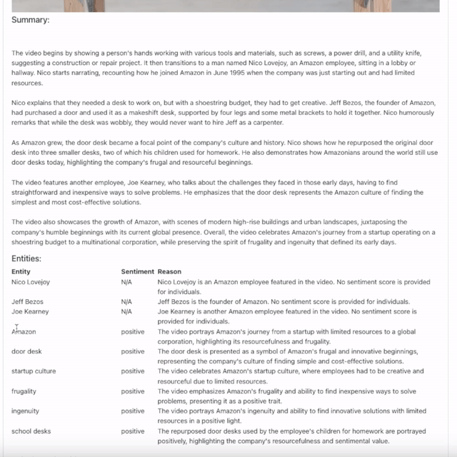
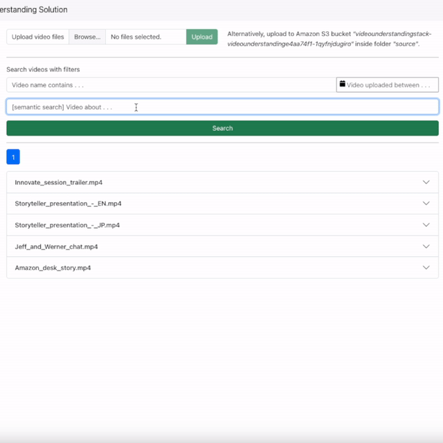
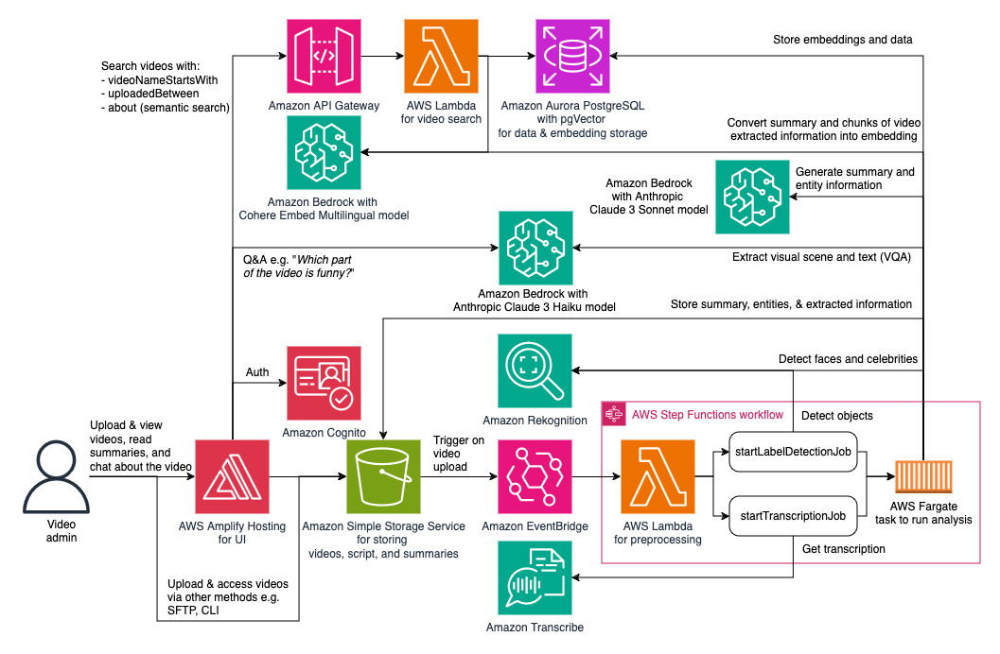

# Video Understanding Solution

## Introduction

This deployable solution enhances video comprehension without requiring full viewing. Simply upload videos to generate AI-powered summaries and extract entities. It enables Q&A interactions like identifying specific elements or scenes. Semantic search capability facilitates finding videos by content. Utilizing an LLM, it comprehends visuals and describes frames. Videos are uploaded to an Amazon S3 bucket, triggering processes such as transcription and object extraction via Amazon Transcribe and Amazon Rekognition. The LLM handles VQA, extracting scenes and visible text. Amazon Bedrock powers the generative AI for summary and entity extraction, while the UI chatbot utilizes it for Q&A. Extracted data is stored in the S3 bucket for further analytics.

**Demo for summarization feature:**

**Demo for entities and sentiment extraction feature:**

**Demo for Q&A 1:**

**Demo for Q&A 2:**

**Demo for Q&A 3:**

**Demo for search feature:**

The diagram below shows the architecture. This is extendable since the summaries, entities, and extracted information are stored in Amazon S3 bucket, which you can use for further purposes. 

